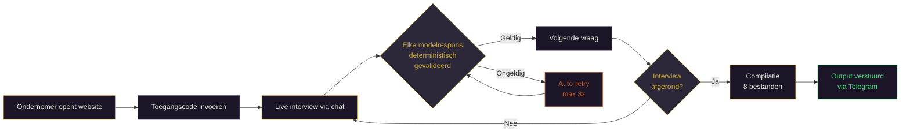

<div align="center">

<br>


<br><br>

### Wat je weet maar nooit opschrijft — dát legt DaKanAI vast.

<br>

[](https://richardclawson013.github.io/DaKanAI/)
&nbsp;&nbsp;
[](https://richardclawson013.github.io/DaKanAI/)

<br>


---

<br>

<table>
<tr>
<td width="600">

**DaKanAI is een AI-gestuurde intake-assistent die MKB-ondernemers interviewt om hun impliciete bedrijfskennis vast te leggen.**

De beslissingen die je op gevoel neemt. De uitzonderingen die nergens staan.
De principes die je bedrijf draaiende houden — maar die je nooit hebt opgeschreven.

DaKanAI haalt ze eruit, valideert ze, en levert ze op als gestructureerde kennisbestanden.

</td>
</tr>
</table>

<br>

</div>

---

<br>

## Drie wetenschappelijke technieken

DaKanAI combineert drie bewezen methoden uit kennismanagement en cognitieve psychologie:

<table>
<tr>
<td width="33%" valign="top">

### Laddering
Graaft laag voor laag dieper.
Van oppervlakkig kenmerk → concreet gevolg → onderliggende waarde.

*"Waarom is dat belangrijk voor je?"*
*"Wat zou er gebeuren als dat wegvalt?"*

Tot de terminale waarde — het fundament.

</td>
<td width="33%" valign="top">

### Critical Decision Method
Ontleedt concrete beslismomenten.
Sweep voor sweep, van overzicht naar detail.

*"Neem me mee naar dat moment."*
*"Wat zag je? Wat wist je toen?"*

De kennis die alleen zichtbaar wordt in de hitte van het moment.

</td>
<td width="33%" valign="top">

### Exception Probing
Vindt waar de regels breken.
De randgevallen, de uitzonderingen, het ongeschrevene.

*"Wanneer geldt dit juist niet?"*
*"Wat doe je als het normaal niet werkt?"*

Daar zit de echte expertise.

</td>
</tr>
</table>

<br>

---

<br>

## Hoe een interview verloopt



<br>

---

<br>

## Output: 8 gestructureerde bestanden

Na elk afgerond interview produceert DaKanAI een compleet kennispakket:

<table>
<tr>
<td width="50%" valign="top">

| Bestand | Inhoud |
|:--------|:-------|
| `wereldmodel.json` | Gestructureerd kennismodel met dekkingslabels |
| `ziel.md` | Kernprincipes en waarden |
| `agents.md` | Rollen en verantwoordelijkheden |
| `skills.md` | Vaardigheden en competenties |

</td>
<td width="50%" valign="top">

| Bestand | Inhoud |
|:--------|:-------|
| `tools.md` | Gereedschappen en systemen |
| `rapport.html` | Visueel rapport in huisstijl |
| `open_onderwerpen.md` | Nog uit te diepen onderwerpen |
| `transcript.json` | Volledig gespreksverslag |

</td>
</tr>
</table>

### Dekkingslabels

Elk kennisfeit krijgt een bewijslabel — niets wordt verzonnen:

> **`GEDEKT`** — Direct door de ondernemer bevestigd, met bronverwijzing naar exacte beurtnummers
>
> **`AFGELEID`** — Logisch afgeleid uit wat gezegd is, met onderbouwing
>
> **`GEEN-DEKKING`** — Nog niet besproken. Een leeg veld is beter dan een verzonnen antwoord.

<br>

---

<br>

## Deterministische validatie

> *Geen LLM-beoordeling. Harde regels. Elke beurt, elke keer.*

Elke modelrespons passeert een validator die controleert:

- Zijn alle **verplichte velden** aanwezig?
- Is het **beurttype** geldig? *(dialoog, naamstap, taak, edge, ziel_principe, skill, tool, afronding)*
- Heeft elke extractie een geldig **dekkingslabel**?
- Verwijzen **`source_turns`** naar bestaande beurten?
- Zijn er **geen onbekende velden** toegevoegd?

Bij een ongeldige respons:

```
Poging 1  →  Fout teruggestuurd naar model met correctie-instructie
Poging 2  →  Nogmaals, met aangescherpte feedback
Poging 3  →  Gracieus herstel — ondernemer merkt er niets van
```

<br>

---

<br>

## Live Monitor

<table>
<tr>
<td>

```
╔════════════════════════════════════════╗
║          D a K a n A I                 ║
║       Live Interview Monitor           ║
╚════════════════════════════════════════╝

┌─ Status ───────────────────────────────┐
│  Server    ● Draait                    │
│  Model     claude-opus-4-5             │
│  Ondernemer  Jan de Bakker             │
│  Beurten   14                          │
└────────────────────────────────────────┘

┌─ Events ───────────────────────────────┐
│ 20:45:01  ● Server gestart             │
│ 20:45:15  ► Nieuw interview gestart    │
│ 20:45:16  ◆ LLM aanroep (opus-4-5)    │
│ 20:45:23  ✓ Antwoord (2847 tekens, 7s) │
│ 20:45:23  ✓ Validator OK (2 beurten)   │
│ 20:45:24  ★ Naam: Jan de Bakker       │
│ 20:51:44  ◆ LLM aanroep (opus-4-5)    │
│ 20:51:51  ✗ Validator FOUT             │
│ 20:51:51  ↻ Retry poging 2             │
│ 20:51:58  ✓ Validator OK               │
│ 20:58:12  ⚙ Compilatie gestart         │
│ 20:58:12  ✓ 8 bestanden geschreven     │
│ 20:58:13  ✈ Telegram verstuurd         │
│ 20:58:13  ■ Interview afgerond         │
└────────────────────────────────────────┘
```

</td>
<td width="300" valign="top">

**Realtime zichtbaarheid**
in een apart terminalvenster.

Elke LLM-aanroep, elke validatie,
elke retry, elke compilatie —
je ziet het gebeuren terwijl
de ondernemer in de browser typt.

Donkerpaars met gouden accenten,
dezelfde huisstijl als de website.

```bash
bash start-monitor.sh
```

</td>
</tr>
</table>

<br>

---

<br>

## Architectuur

```
DaKanAI/
│
├── interview/                  # Het brein
│   ├── engine.py               #   Gesprekssturing, LLM-calls, retry & herstel
│   ├── validator.py            #   Deterministische validatie per beurt
│   ├── compiler.py             #   Transcript → 8 output-bestanden
│   ├── interview_status.py     #   Ronde-telling, noodrem, destillatie
│   ├── system_prompt.py        #   Interview-protocol & welkomstbericht
│   └── events.py               #   Event-logging voor live monitor
│
├── server/                     # HTTP-laag
│   ├── app.py                  #   Flask server, CORS, rate limiting
│   ├── codes.py                #   Timing-safe code-validatie
│   └── telegram_bot.py         #   Output-levering via Telegram
│
├── web/
│   └── index.html              #   Frontend in huisstijl
│
├── monitor.py                  #   Live TUI-dashboard (Rich)
├── run.sh                      #   Server starten
└── start-monitor.sh            #   Monitor starten
```

<br>

---

<br>

## Technologie

<table>
<tr>
<td align="center" width="140">
<br>
<sub><b>Python 3</b></sub><br>
<sub>Engine & Server</sub>
</td>
<td align="center" width="140">
<br>
<sub><b>Claude Opus 4.5</b></sub><br>
<sub>via OpenRouter</sub>
</td>
<td align="center" width="140">
<br>
<sub><b>Telegram</b></sub><br>
<sub>Output-levering</sub>
</td>
<td align="center" width="140">
<br>
<sub><b>Flask</b></sub><br>
<sub>HTTP + CORS</sub>
</td>
<td align="center" width="140">
<br>
<sub><b>Cloudflare</b></sub><br>
<sub>Tunnel</sub>
</td>
</tr>
</table>

<br>

---

<br>

<div align="center">

### Huisstijl

*Geïnspireerd door de scrollytelling-sfeer van SBS's "The Boat"*
*— gedempt, sfeervol, onderdompeling in plaats van "website-gevoel".*

<br>

`#1c1528` Heel donkerpaars &nbsp;·&nbsp; `#2d2839` Oppervlak &nbsp;·&nbsp; `#c9a832` Goud &nbsp;·&nbsp; `#b85a2a` Donkeroranje &nbsp;·&nbsp; `#ece8df` Warm wit

<br>

---

<br>

[](https://richardclawson013.github.io/DaKanAI/)

<br>

<sub>Eigendom van <a href="https://dakan.ai">Dakan.ai</a> · Niet voor herdistributie</sub>

</div>
